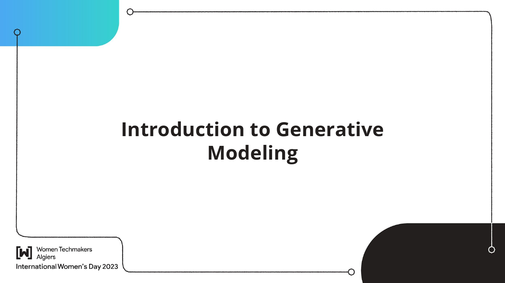

# IWD-GenerativeModelingWorkshop
This repo contains the slides to the workshop entitled "Introduction to Generative Modeling using GANs" held by me at IWD Hackathon session 2023 by https://www.gdgalgiers.com/ and WTM ALGIERS.
### IWD-GenerativeModelingWorkshop

### Description:
- This repo contains the slides to the workshop entitled "Introduction to Generative Modeling using GANs" held by me at IWD Hackathon session 2023 by https://www.gdgalgiers.com/ and WTM ALGIERS.
### About the Workshop
This workshop is aimed at individuals who want to explore the world of generative modeling. The primary goals are:
- Understanding the Fundamentals of Data Science and Machine Learning.
- Understanding the core concepts of generative modeling.
- Understanding the Concepts of GANs and AEs.
- Practical tips and tricks for Learning Artificial Intelligence.

### Prerequisites
- Basic understanding of Artificial Intelligence Concepts

## Table of Contents
- [Machine and Deep Learning Basics]
- [Supervised - Unsupervised - Semi-Supervised Learning]
- [Classification VS Regression VS Clustering VS Dimensionality Reduction](#workshop-materials)
- [Discriminative Models]
- [Generative Models]
- [AutoEncoders]
- [Generative Adversarial Networks]

### Slides
- [View Slides](https://github.com/Hypatchia/IWD-GenerativeModelingWorkshop/blob/main/IWD'23%20Algiers%20Slides.pdf)

### Additional Resources
- [Online Course: Generative Adversarial Networks Specialization](https://www.coursera.org/specializations/generative-adversarial-networks-gans)
- [Online Blog: Google Developer Blog](https://developers.google.com/machine-learning/gan)https://developers.google.com/machine-learning/gan)

